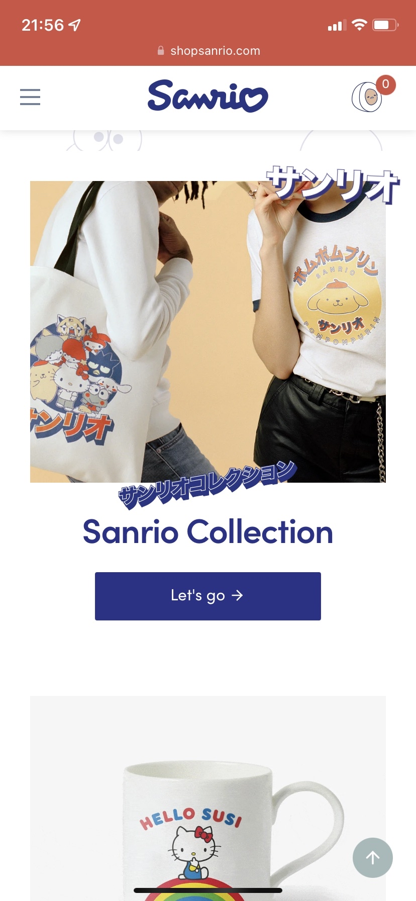
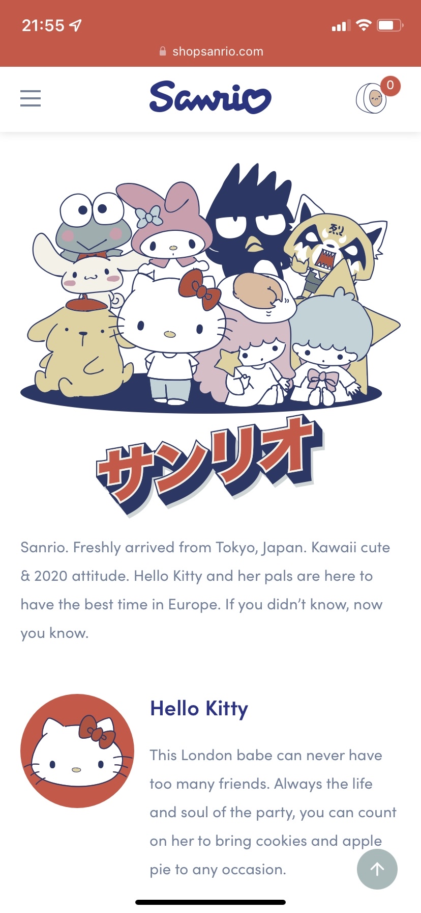
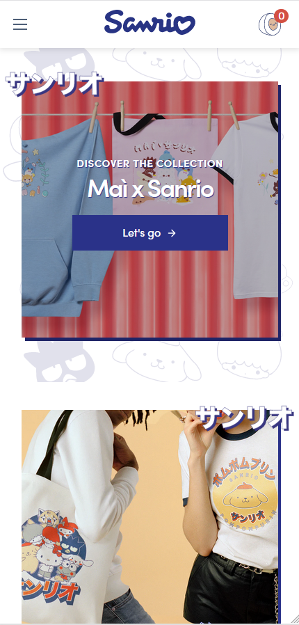
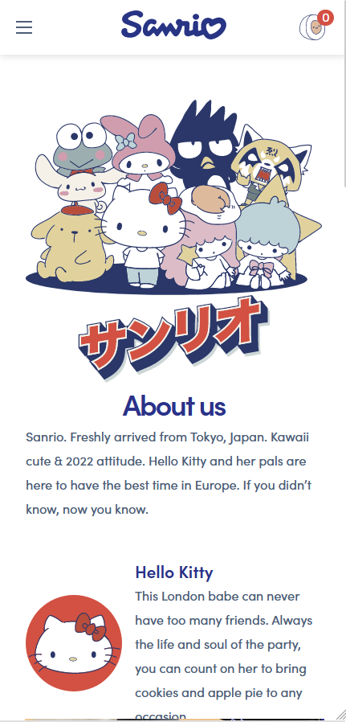
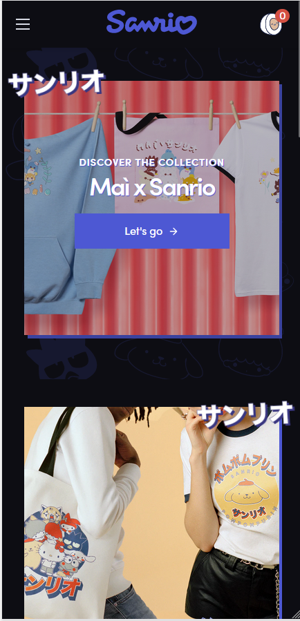
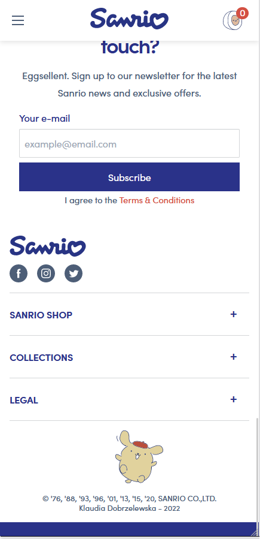
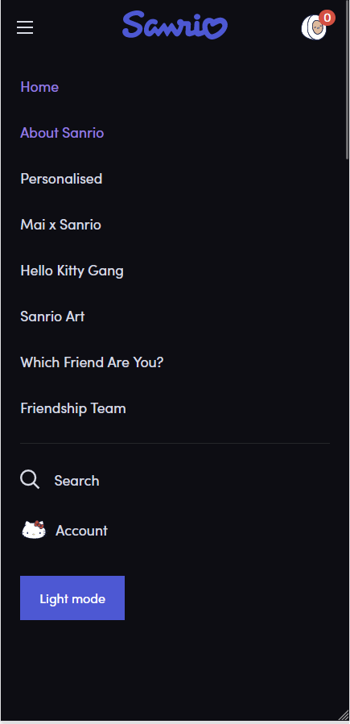

# Procesverslag
Markdown is een simpele manier om HTML te schrijven.  
Markdown cheat cheet: [Hulp bij het schrijven van Markdown](https://github.com/adam-p/markdown-here/wiki/Markdown-Cheatsheet).

Nb. De standaardstructuur en de spartaanse opmaak van de README.md zijn helemaal prima. Het gaat om de inhoud van je procesverslag. Besteedt de tijd voor pracht en praal aan je website.

Nb. Door *open* toe te voegen aan een *details* element kun je deze standaard open zetten. Fijn om dat steeds voor de relevante stuk(ken) te doen.

## Jij

### Auteur:
  Klaudia Dobrzelewska

  #### Je startniveau:
  Rood

  #### Je focus:
  Surface laag

## Je website

  ### Je opdracht:
  https://shopsanrio.com/

  #### Screenshot(s) van de eerste pagina (small screen): 
  
  De home pagina.

  #### Screenshot(s) van de tweede pagina (small screen):
  
  De over ons pagina.
 

## Toegankelijkheidstest 1/2 (week 1)

  ### Bevindingen
  Lijst met je bevindingen die in de test naar voren kwamen:

  #### Screenreader
  Hier korte omschrijving (met indien nodig afbeeldingen)
  * De afbeeldingen hebben geen alt-tekst.
  * Links op de homepagina zeggen allemaal hetzelfde, waardoor het verwarrend kan zijn.
  * De pop-up bovenaan de pagina om te subscriben wordt op elke pagina gelezen.
  * Niet altijd duidelijk waar je je precies bevindt op de pagina door de hoeveelheid div'jes.
  * Menu wordt telkens helemaal gelezen.
  
  Hier een omschrijving van hoe het opgelost kan worden (met indien nodig afbeeldingen)
  * Alt-tekst toevoegen aan alle afbeeldingen.
  * Link titels duidelijk maken.
  * Pop-up weghalen of anders coderen.
  * Geen gebruik maken van div.
  * Menu anders coderen.

  #### Muis en Toetsenbord 
  Hier korte omschrijving (met indien nodig afbeeldingen)
  * Navigatie gaat over het algemeen wel goed.
  * Met tab ga je eerst alle menu opties af en dat zijn er best veel.

  Hier een omschrijving van hoe het opgelost kan worden (met indien nodig afbeeldingen)
  * Menu anders coderen (dus dropdown open als je op enter drukt of iets).

  #### Motoriek (shocks, elastiekjes)
  Hier korte omschrijving (met indien nodig afbeeldingen)
  * Navigeren gaat lastig.
  * Sneltoetsen worden eerder ingedrukt.

  Hier een omschrijving van hoe het opgelost kan worden (met indien nodig afbeeldingen)
  * Niet veel. De knoppen op de website zijn al best groot. 

  #### Visueel (brillen, contrast, kleurenblind, dark/light). 
  Hier korte omschrijving (met indien nodig afbeeldingen)
  * De links en tekstkleur zijn best licht waardoor ze lastig te lezen kunnen zijn.
  * Contrast van het kleurenschema is goed (behalve de links uit het menu).
  * Knoppen zijn best groot, waardoor navigeren niet zo lastig is.
  * Foto's zijn groot waardoor ze goed zichtbaar zijn.
  * Linkkleur verandert zodat je weet waar je je momenteel bevindt.

  Hier een omschrijving van hoe het opgelost kan worden (met indien nodig afbeeldingen)
  * Een kleur met wat meer contrast voor de menu linkjes en tekst.

## Breakdownschets (week 1)

  ### De hele pagina: 
  

  ### Navigatie: 
  

  ### Dropdown: 
  

## Voortgang 1 (week 2)

  ### Stand van zaken
  Ik had best veel moeite met opstarten. Ik ben meerdere malen opnieuw begonnen, omdat de header maar niet wilde meewerken. Ik heb alle HTML en content wel af.

  ### Agenda voor meeting
  Helaas was ik niet bij deze meeting door problemen met mijn gezondheid op dat moment. Ik heb voor mezelf gewoon een planning gemaakt en vragen die ik eventueel kan stellen in de volgende les dat ik er wel ben.

  ### Verslag van meeting
  Helaas was ik niet bij deze meeting door problemen met mijn gezondheid op dat moment. Deze vragen heb ik wel opgeschreven voor de volgende les:
  * Hoe moet ik de achtergrond afbeelding toevoegen aan de eerste article? -> Met ::before
  * Hoe moet ik de animatie onderaan het scherm namaken? Javascript of alleen CSS? -> Vooral JavaScript, CSS kan voor de animatie

## Voortgang 2 (week 3)

  ### Stand van zaken
  Aangezien ik niet ver kwam met mijn eerste versies ben ik opnieuw begonnen met de CSS. Dit is tot nu toe wel goed gegaan, maar ik ben helaas nog niet zo ver.

  ### Agenda voor meeting
  Helaas was ik niet bij deze meeting door problemen met mijn gezondheid op dat moment. Ik heb voor mezelf gewoon een planning gemaakt en vragen die ik eventueel kan stellen in de volgende les dat ik er wel ben.

  ### Verslag van meeting
  Ik ben de dag voor de meeting in gesprek gegeaan met de docent over mijn voortgang. Deze vond hij prima, vooral ook omdat ik net weer opnieuw ben begonnen. Voor de rest heb ik de vragen van vorige week gesteld en een paar nieuwe.
  * Mag ik een class gebruiken voor de tweede pagina? Als niet, wat moet ik dan doen? -> Classes mogen in dit geval
  * Moet ik het voorbeeld precies volgen of kan ik ook dingen aanpassen? -> Dingen mogen aangepast worden
  * Moet ik de main foto ook als achtergrond plaatsen zoals de origineel, of als een image element? -> Image element is toegankelijker 

## Toegankelijkheidstest 2/2 (week 4)

  ### Bevindingen
  Lijst met je bevindingen die in de test naar voren kwamen (geef ook aan wat er verbeterd is):

  #### Screenreader
  Hier korte omschrijving (met indien nodig afbeeldingen)

  Hier een omschrijving van hoe het opgelost kan worden (met indien nodig afbeeldingen)

  #### Muis en Toetsenbord 
  Hier korte omschrijving (met indien nodig afbeeldingen)

  Hier een omschrijving van hoe het opgelost kan worden (met indien nodig afbeeldingen)

  #### Motoriek (shocks, elastiekjes)
  Hier korte omschrijving (met indien nodig afbeeldingen)

  Hier een omschrijving van hoe het opgelost kan worden (met indien nodig afbeeldingen)

  #### Visueel (brillen, contrast, kleurenblind, dark/light). 
  Hier korte omschrijving (met indien nodig afbeeldingen)

  Hier een omschrijving van hoe het opgelost kan worden (met indien nodig afbeeldingen)

## Voortgang 3 (week 4)

  ### Stand van zaken
  De CSS van beide pagina's  is af. Ik moet nog beginnen aan de JavaScript en de extraatjes voor de surface plane, daarna ben ik klaar.

  ### Agenda voor meeting
  Aangezien ik er helaas weer niet bij kon zijn heb ik vrijdag 30 september met Nina Vens gebeld, een van onze studentassistentes. Die heeft mijn voortgang bekeken en een hoop vragen die ik had beantwoord.

  ### Verslag van meeting
  De voortgang vond ze prima en ze vond het er goed uitzien. Deze vragen heb ik allemaal gesteld tijdens ons gesprekje:
  * Welke CSS file is beter qua hierarchie? -> Maakte niet veel uit, dus ik heb de kortere gekozen
  * Heb je tips voor de animatie in de footer? -> IntersectionObserver gebruiken
  * Moet ik een label aanmaken voor de formulier in plaats van de placeholder en als wel hoe moet ik deze koppelen? -> Ja en koppelen met "for=" en id=""
  * Hoe moet ik de bronnen goed vermelden? -> In de readme, eventueel ook in een comment

## Eindgesprek (week 5)

  ### Je uitkomst - karakteristiek screenshots:
  
  
  

  ### Dit ging goed/Heb ik geleerd: 

  #### Ging goed
  * Het opnieuw beginnen ging steeds soepeler.
  * Flexbox gebruiken ging beter dan vorig jaar.
  * HTML en CSS gingen over het algemeen wel soepel.
    
  #### Geleerd
  * Ik ben gegroeid in het snappen van JavaScript. Veel nieuwe dingen toegepast en uitgeprobeert waarvan ik dacht dat het te lastig zou zijn voor mij.
  * Ik heb veel nieuwe CSS opties ontdekt.
  * Ik heb alleen met SVG en Webp files gewerkt, wat ik nog niet eerder heb kunnen doen.
  * CSS animaties met Berzier curve.
  * Elementen selecteren zonder overal classes toe te voegen.
  * Position en grid geleerd.

  

  ### Dit was lastig/Is niet gelukt:

  #### Lastig
  * Moeite met JavaScript, vooral IntersectionObserver en de media query code.

  #### Niet gelukt
  * Sanrio logo goed in het midden krijgen, vooral bij responsiveness. Waarschijnlijk zou ik dit kunnen verbeteren via trial en error, maar aangezien ik heb gefocused op de surface plane heb ik het laten gaan.
  * Dark mode kleurenschema mooi maken. Het voelt net niet goed aan. Gelukkig is het wel contrast ratio vriendelijk.
  * Dark mode icoontjes veranderen van het menu.
  * Responsiveness ook uitwerken. Als iets meer tijd had zou het wel lukken, denk ik.
  * Dark mode knop is niet te klikken in Safari door de onderste border.

  

## Bronnenlijst

  1. De originele website: https://shopsanrio.com/. Dit heb ik gebruikt voor content, sommige afmetingen van elementen en de animaties voor Gudetama en wiggle.
  2. IntersectionObserver tutorial: https://www.youtube.com/watch?v=_5Bu3JY-ZHc. Dit heb ik gebruikt voor de animatie onderaan de pagina van PomPomPurin. Ik heb nog nooit eerder van IntersectionObserver gehoord en ben met deze tutorial aan de slag gegaan om de basic setup te maken. Details heb ik zelf aangepast, zodat het zou passen bij wat ik wilde.
  3. Media query in Javascript oproepen: https://developer.mozilla.org/en-US/docs/Web/API/Window/matchMedia. Op deze pagina heb ik kunnen leren hoe ik een Media query kan oproepen in JavaScript voor de dark mode versie. Details heb ik zelf aangepast, zodat het zou passen bij wat ik wilde.
  4. Gudetama theme song: https://www.youtube.com/watch?v=GKokWX011B4. Gebruikt voor de easter egg.

